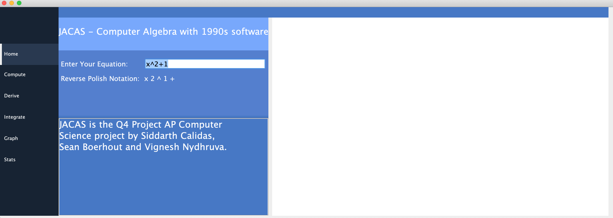
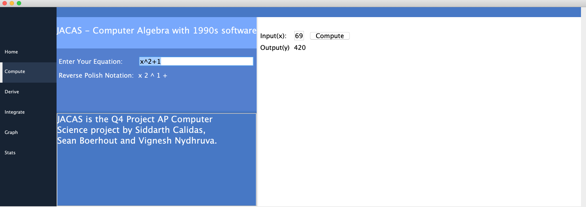
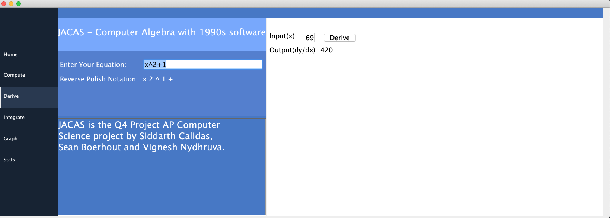
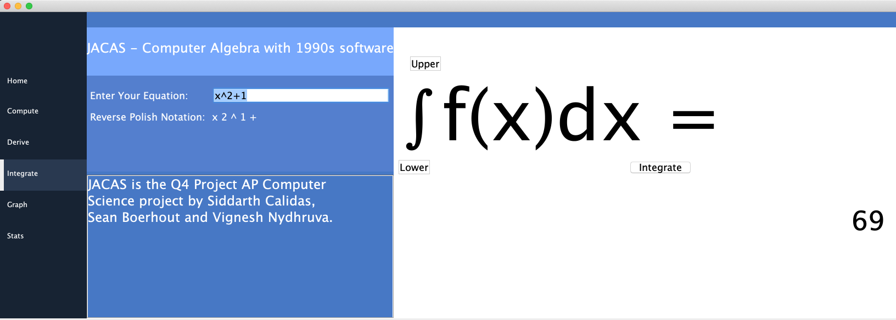
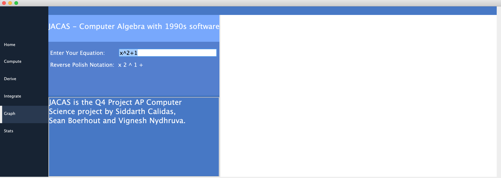
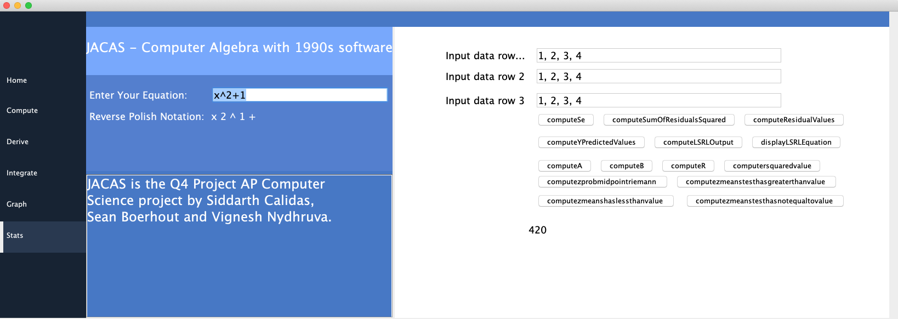

# JavaCalculator

🚀 JaCAS: A Java Computer Algebra System 🚀

🚀 Functionalities:

- derivative at a point
- definite & improper integrals
- graphing
- series 
- statistics functions (significance tests, linear regression, etc.) 
- root tests
- and other various calculations... 

🚀 Here are some screenshots of our UI for the calculator: 

  

  

  

  

  

  

 

 

## Algebra Class 🚀
🚀 The <samp>Algebra</samp> class contains code for computing the zeros of a function, using one of Newton's algorithms. Using our derivative logic from the <samp>Calculus</samp> class along with the bisection step, we can compute the zeros of a <samp>Function</samp> object. The bisection step helps us find the roots of a function within a certain region, whose result is incorporated into the actual root calculating method. 

  

 

## Calculus Class 🚀
🚀 The <samp>Calculus</samp> class contains code logic for computing definite & impropoer integrals, derivative at a point, series (with respect to sums), and end behavior of a function. The definite integral method uses a <samp>for</samp> loop to iterate over a certain interval on the x-axis, and utilizes many, many midpoint Riemann sums to provide an extremely accurate result (a variation of the formula is shown below). The improper integral method makes use of the derivative & definite integral calculator in order to approximate the integral of a function as x approaches -∞ or +∞. If the absolute value of the derivative is very close to 0 as $|x|$ becomes infinitely large, then we take the definite integral from the constant (in the argument) to a very large number, else, the improper integral is not possible. The derivative at a point method returns a highly accurate value, since it takes in account a very small change in y over a very small change in x, which represents the slope of the function at the particular x-value. The <samp>computeSum</samp> method returns a mathematical sum of the output values of a particular function between an interval of x-values, using a <samp>for</samp> loop. Finally, we have code for computing the end behavior of a function. How it works is that as the derivative of the function approaches 0 as x approaches +∞ or -∞, then the approximate y-value of the function is returned, else, the end behavior of the function cannot be determined, since the function does not have a horizontal asymptote. 

  

 

<!-- $$
A_{midpointRiemann} \approx \lim_{n\to\infty}{\sum_{i=1}^{n}}f(x_i^*)(\Delta x^*)
$$  -->

  

 

## Function Class 🚀
🚀 The <samp>Function</samp> class defines all functions used for computations and other mathematical methods in binary pairs. On input, all functions are simplified to multiple <samp>Function</samp> objects that contain each other so that large functions can be simplified into binomial or monomial expressions. This creates a virtually recursive system since each function can invoke the <samp>compute()</samp> method on its parameters, which will then compute there parameters, and so on and so forth. This means that all variables, numbers, operations, and functions are stored as <samp>Function</samp> objects, making parsing from Reverse Polish Notation to a <samp>Function</samp> object very easy. The <samp>Function</samp> class also remembers all computations that it performs, so if the <samp>Function</samp> is computed at a certain point, it will simply return the previously calculated value without recalculating the value in order to save time. 

  

 

## Graphing Class 🚀
🚀 The graphing algorithm graphs all points of a function, or multiple functions, on a coordinate plane. It uses a while loop that evaluates each function on a defined interval in order to produce the graph. All the points are then connected with small line segments since this allows the graph to be more smooth and accurate. The grapher also includes generation for the coordinate axis and even gridlines that can be spaced apart at set intervals. 

  

 

## GUIv3 Class 🚀
🚀 The <samp>GUIv3</samp> class contains code for generating the entire UI, sometimes using Netbeans and Visual Studio Code. The UI is developed using Java Swing, a desktop application library. All the code to integrate the backend with the frontend was made possible by <samp>java.awt.event.MouseEvent evt</samp> to detect mouse input. By writing listeners on all the buttons, we were able to detect and use input from the frontend. We developed 3 versions of the UI before arriving at our final version.

  

 

## InfixParser Class 🚀
🚀 The InfixParser class contains methods for parsing infix expressions like (x^2+1) into Reverse Polish notation. Reverse Polish
notation is easier for our algorithms to process, so it is imperative that we correctly convert infix expressions. It needs to 
respect the order of operations, so we resorted to an algorithm invented by Edsger Dijkstra to do just this: The
shunting yard algorithm(named for its resemblance to a train shunting yard) 🚀. The infixparser class has some helper methods
and one static method: parse(String infix). This method runs the shunting yard algorithm and returns the RPN version
of the input string.

  

## Main Class 🚀
🚀 This is just a class we use to test certain methods, logic, etc. 

## Statistics Class 🚀
🚀 The <samp>Statistics</samp> class is essentially split into 2 parts, linear regression significance tests. The linear regression part of the class contains code logic for certain statistics and equations, such as the least-squares regression line (LSRL), the correlation coefficient $(r)$, standard error of the residuals $(S_e)$, etc. The significance tests' section comprises of 3 significance tests for means (when the population standard deviation is known). Based on the statistics that the user inputs, these tests tell the user whether to either reject the null hypothesis $H_0$ or fail to reject the null hypothesis.

  

## Exception classes 🚀

🚀 These classes define exceptions for invalid mathematical calculations or anything that makes function computation incorrect.

### ArithmeticException Class 
The <samp>ArithmeticException</samp> defines an arithmetic exception that is thrown when an invalid mathematical operation is done. For instance, dividing by zero would result in an <samp>ArithmeticException</samp>. 

### OperatorOnlyException Class 
The <samp>OperatorOnlyException</samp> class defines a specific exception that will be thrown, when a <samp>Function</samp> object is only an operator and nothing else. 

### InvalidInputsException Class 
The <samp>InvalidInputsException</samp> class defines a specific exception that will be thrown, when a <samp>Function</samp> object is inputted incorrectly. 
The <samp>InvalidInputsException</samp> class defines a specific exception that will be thrown, when a <samp>Function</samp> object is inputted incorrectly. 

### VariableDefinitionException Class 
The <samp>VariableDefinitionException</samp> defines a specific exception that will be thrown when a variable is not defined. 